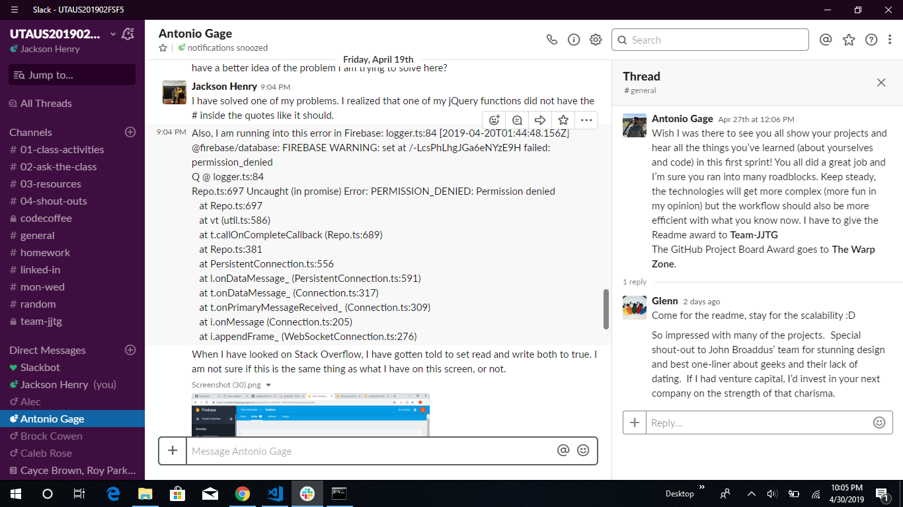
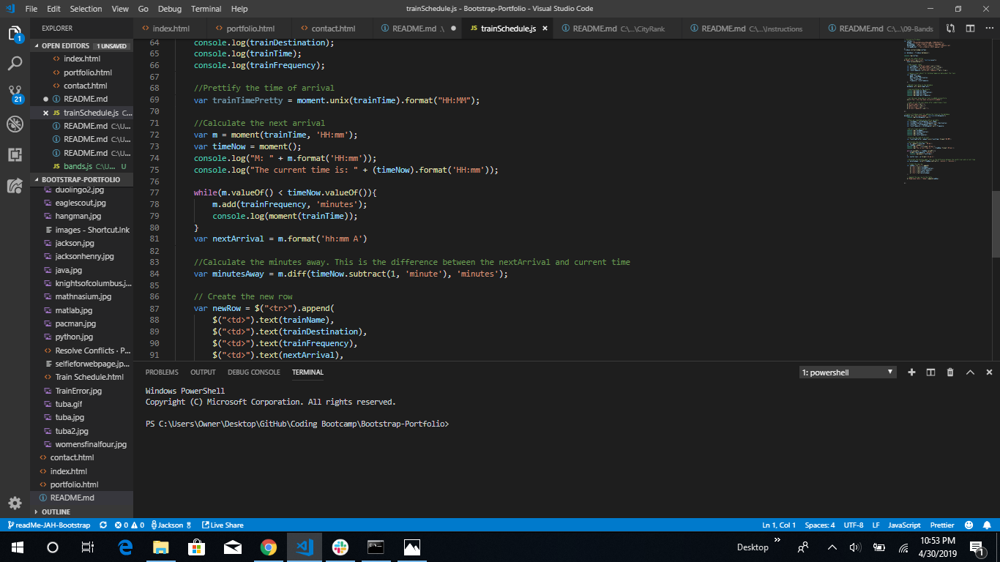
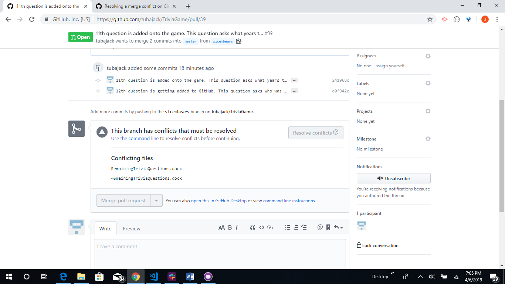

# Bootstrap-Portfolio

This project is the second assignment for the Coding Bootcamp at the University of Texas at Austin.

For this project, I used Bootstrap to build my personal website. This website has three separate parts which are About Me, Portfolio and Contact.

# About Me
I graduated from Baylor University with a Bachelor's of Science in Applied Mathematics. 

Currently, I am a Sortation Associate at Amazon and a Mathematics instructor at Mathnasium. 
I chose to pursue the Coding Bootcamp at UT Austin in order to further my skills in software development, and because I aspire 
to become a full stack software engineer in the future. 

Some of my research interests include Artificial Intelligence and Machine Learning. These fields interest me because I aspire to learn more about the systems and tools we interact with daily, figure out ways to improve them, and help create cutting edge applications which will make the world a better place. 

# Portfolio
The portfolio describes projects that I have been working on, both at the Coding Bootcamp and outside of Coding Bootcamp. 

## Group Project- CityRank
Recently, I worked with three other developers on a CityRank project. 
In this project, we ranked cities throughout the United States based on three factors: Happiness, Affordability and Political Views. 

My primary role in the project was designing and building the algorithm. 
One of my biggest challenges in this project was trying to figure out where to start here. I was originally planning to use a Machine Learning algorithm to predict what would be the best city someone would use. I was planning to compare the Neural Network, Random Forest, or a Gradient Boosting Algorithm to see what would give me the most accurate results. 

After talking to my group about this, they told me that I was way overthinking the algorithm. After looking at the data, Glenn, one of my group members suggested that I needed to only use a simple algorithm based on distance. 

Ultimately, I decided to go with a vector distance calculation. The smaller the distance your preferences were from the city, the better that city would be for you to live in. 

How the Algorithm worked: The user's preference is at a point in three-dimensional space. Each of our three preferences (affordability, politics, and happiness) were on separate axes. In addition, each of our three cities were also represented by a point in 3-space. 

We used the distance formula to calculate the distance from the user's preference vector and a city's attribute vector. 
This formula was used for all 182 cities in our database. 
Each distance was dumped into an array, and this array would then be sorted from least distance to greatest distance. 
The shortest distance would ultimately give us the 'best' match based on those factors. 

Another Challenge was the fact that affordability had a massive range (82,500 to 900,000). If we did not scale all of our factors, affordability would have had approximately a 99.99% weight and the other 2 factors would have had no weight at all. 

To fix this problem, we took the difference of the userPreference value and the minimum value and then multiplied that by the quotient of 100 and the range. 

Formula used: *(userPrefence - minValue) * (100/(maxValue-minValue)*

Deployed Code: https://team-jjtg.github.io/CityRank/

Link to the GitHub Code: https://github.com/team-jjtg/CityRank

## Train Scheduler
Another project that I worked on was a project to build a Train Scheduler. 

To build the basic structure of the website, I used Bootstrap. 

JavaScript was used for the logic of the website. 

jQuery was used for functionality. 

Firebase was used for the database. 

**Challenge** : Trying to get Firebase to display all of the data. 
When I was working on this project, I ran into this error. 

To solve this problem, I: 
1. Got onto the Firebase website
2. Clicked on the Database. 
3. After that, I clicked on Realtime Database. 
4. Went under Rules, and then set the Read and Write to true. 

**2nd Challenge**: Another issue I ran into was not getting the time to display correctly.

To solve this problem, I had to declare a variable using moment.js to display the current time. 
I needed a current time to base the scheduler off of. 
After declaring that variable, the time worked like it was supposed to.

Deployed Code: https://tubajack.github.io/Train-Scheduler/

Link to the GitHub repo: https://github.com/tubajack/Train-Scheduler

## Trivia Game
Another project created in this bootcamp was to create a Trivia Game. 

I decided to create this Trivia game about my undergraduate school, Baylor University. 

Languages used: HTML, JavaScript, jQuery

**Challenge** : I had a merge conflict problem on GitHub. 
This problem took about 30 minutes to solve. 

*Solution*: There were a couple of corrupted files on the GitHub file. I had to delete the files from GitHub and from my file. 
To preserve the questions I had, I copied all questions to a notepad file. 

Deployed Code: https://tubajack.github.io/TriviaGame/

Link to the GitHub repo: https://github.com/tubajack/TriviaGame

# Contact

**Twitter**: https://twitter.com/tubajack?lang=en
**LinkedIn**: https://www.linkedin.com/in/jackson-henry/
**GitHub**: https://github.com/tubajack

